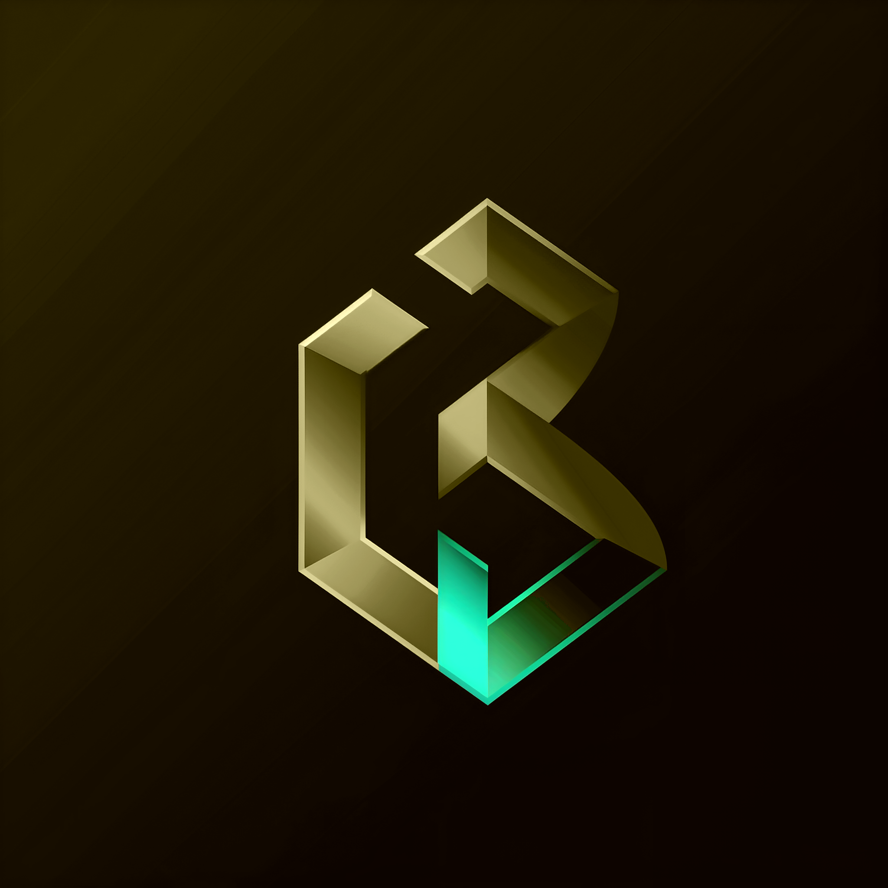

<a href="https://livekit.io/">
  
</a>

### 1. Main Page

#### Components:
- **Title/Header:** "Welcome to MiniMeet"
- **Create Meeting Button:** "Create Meeting"
- **Join Meeting Button:** "Join Meeting"

#### Layout:
- Centered title at the top.
- Two large buttons centered on the page: one for creating a meeting and one for joining a meeting.

---

**Main Page Layout:**
```
--------------------------------------
|            Welcome to MiniMeet     |
|                                    |
|          [Create Meeting]          |
|                                    |
|          [Join Meeting]            |
--------------------------------------
```

---

### 2. Create Meeting Page

#### Components:
- **Title/Header:** "Create a New Meeting"
- **Meeting Name Input Field:** Placeholder text "Enter meeting name"
- **Generate Meeting Button:** "Generate Meeting"

#### Layout:
- Title at the top.
- Input field for the meeting name.
- Button to generate the meeting.

---

**Create Meeting Page Layout:**
```
--------------------------------------
|        Create a New Meeting        |
|                                    |
|   [Enter meeting name __________]  |
|                                    |
|          [Generate Meeting]        |
--------------------------------------
```

---

### 3. Join Meeting Page

#### Components:
- **Title/Header:** "Join a Meeting"
- **Meeting ID Input Field:** Placeholder text "Enter meeting ID"
- **Join Meeting Button:** "Join Meeting"

#### Layout:
- Title at the top.
- Input field for the meeting ID.
- Button to join the meeting.

---

**Join Meeting Page Layout:**
```
--------------------------------------
|            Join a Meeting          |
|                                    |
|   [Enter meeting ID ____________]  |
|                                    |
|          [Join Meeting]            |
--------------------------------------
```

---

### 4. Meeting Page

#### Components:
- **Title/Header:** "Meeting: [Meeting Name]"
- **Video Display Area:** Large central area for video feeds.
- **Participants List:** Sidebar showing participants.
- **Controls:** Mute, Unmute, Video On/Off, End Call, Chat.

#### Layout:
- Title at the top with the meeting name.
- Large video display area in the center.
- Sidebar on the right for participants.
- Controls at the bottom.

---

**Meeting Page Layout:**
```
------------------------------------------------
| Meeting: [Meeting Name]                      |
|----------------------------------------------|
|                                              |
|      [Video Display Area]                    |
|                                              |
|----------------------------------------------|
| [Mute] [Unmute] [Video On/Off] [End Call] [Chat] |
------------------------------------------------
| Participants:                                |
| - User1                                      |
| - User2                                      |
| - User3                                      |
------------------------------------------------
```

---

### User Flow

1. **Main Page:**
   - User lands on the main page and sees two buttons: "Create Meeting" and "Join Meeting".

2. **Create Meeting:**
   - User clicks "Create Meeting".
   - User is taken to the Create Meeting Page.
   - User enters a meeting name and clicks "Generate Meeting".
   - A new meeting is created, and the user is redirected to the Meeting Page.

3. **Join Meeting:**
   - User clicks "Join Meeting".
   - User is taken to the Join Meeting Page.
   - User enters the meeting ID and clicks "Join Meeting".
   - The user is redirected to the Meeting Page.

4. **Meeting Page:**
   - Users in the meeting can see video feeds, a list of participants, and use controls for audio, video, and chat.


## Demo

Give it a try at https://meet.im3.live